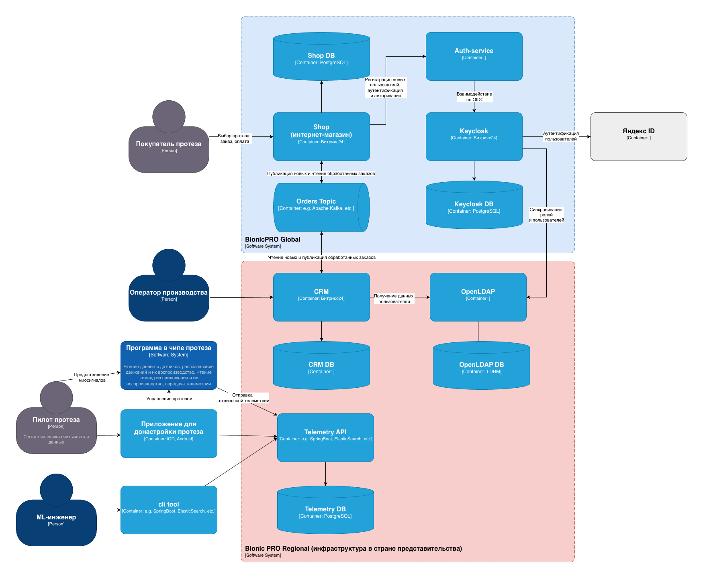
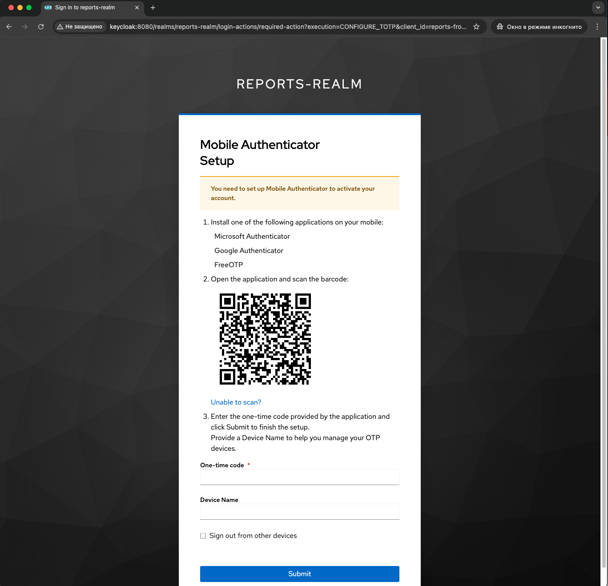
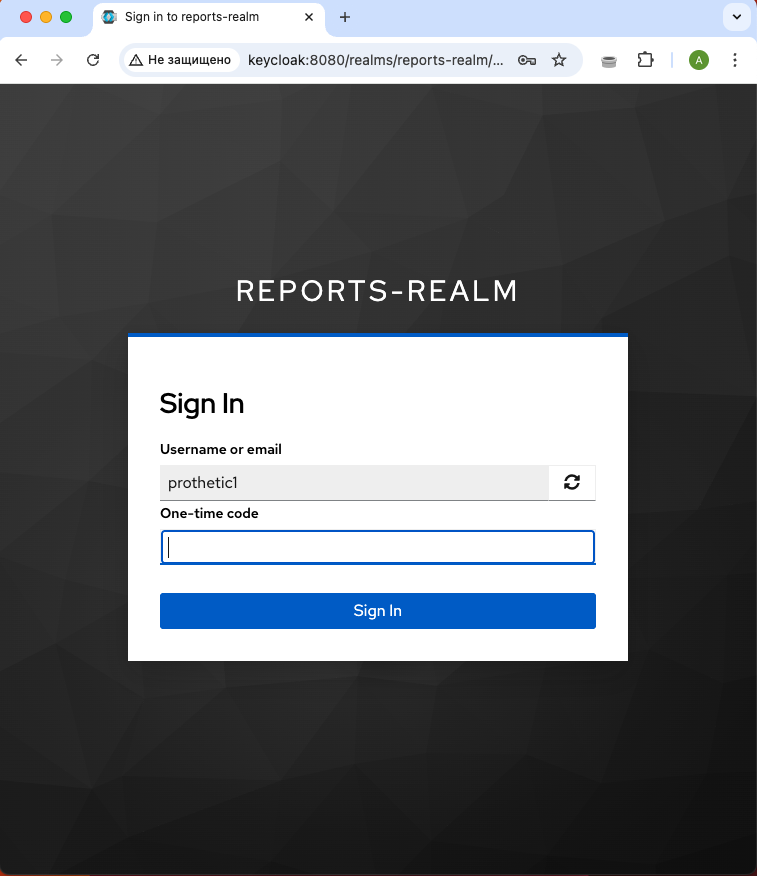
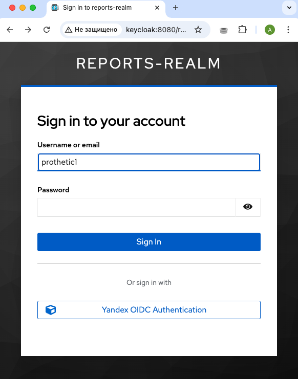
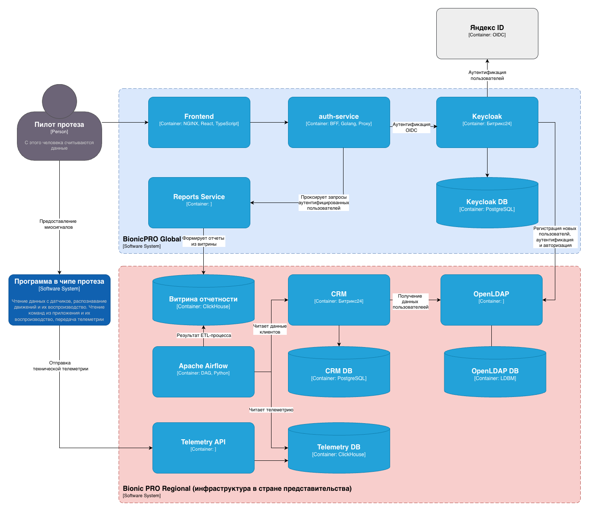
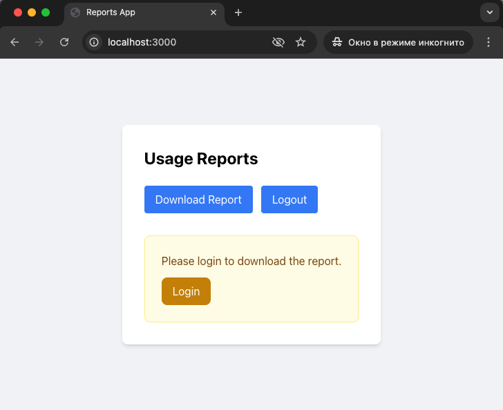

# Bionic PRO

## Задание 1: Повышение безопасности системы

### Задача 1. Предложите архитектурное решение и доработайте диаграмму C4 для управления учётными данными пользователя. 

Вариант 1 диаграммы архитектуры системы, учитывающей следующие аспекты безопасности:
- Запрос данных учётных записей из внешнего источника (OpenLDAP на схеме), который расположен в стране представительства компании. Принципы локального хранения персональной и медицинской информации не должны быть нарушены.
- Безопасную схему работы с access- и refresh-токенами, которая исключает передачу фронтенду токенов, которые были получены от IdP (токены хранятся в Auth-service на схеме).
- Аутентификации пользователей через различные внешние удостоверяющие службы, действующие в разных странах (в качестве примера Яндекс ID на схеме).



### Задача 2. Улучшите безопасность существующего приложения, заменив Code Grant на PKCE

Для реализации PKCE Flow внесен изменения в настройки Keycloak:
```json
    "clients": [
      {
        "clientId": "reports-frontend",
         ...
        "attributes": {
          "pkce.code.challenge.method": "S256"        
        }
      },
```
и в коде Frontend:
```ts
export const initOptions = {
  onLoad: 'check-sso',                      // perform a silent session 
  pkceMethod: 'S256',                       // enforce PKCE for extra SPA security
  silentCheckSsoRedirectUri: `${window.location.origin}/silent-check-sso.html`,
};
```
[Код, реализующий PKCE flow](flow-pkce)

### Задача 3. Обеспечьте безопасное получение и хранение access-и refresh-токенов

Реализован новый сервис согласно выбранной архитектуре, реализующий следующий функционал:
- интеграция с Keycloak
- работа с сессиями
- работа с Access Tokens и Refresh Tokens
- Access Token, Refresh Token, Code Verifyer и прочие атрибуты сессии хранятся в памяти сервиса
- Access Token обновляется через Keycloak с использованием Refresh Token, при получении нового Access Token получается также новый Refresh Token
- Frontend отдается сессеонная Cookie, которая в дальнейшем проверяется на Backend
- предотвращение `Session Fixation Attack`. Для этого при очередном запросе к защищённому ресурсу при успешной проверке сессии на сервисе он перепривязывает Access Token и Refresh Token к новому session id, обновляет cookie и возвращает новый session id в ответе Frontend.
- Frontend больше не работает с токенами, а работает с сессионными Cookie, убрана интеграция с Keyclok.

[Код сервиса Auth-service (Go)](bionicpro-auth).  
[Код исправленного Frontend](frontend)

### Задача 4. Добавьте LDAP для возможности получения данных о пользователях представительства BionicPRO в другой стране

Настроена интеграция Keycloak с OpenLDAP:
```json
        "config": {
          ...
          "usersDn": [
            "ou=People,dc=example,dc=com"
          ],
          "usernameLDAPAttribute": [
            "uid"
          ],
          "bindDn": [
            "cn=admin,dc=example,dc=com"
          ],
          "bindCredential": [
            "**********"
          ],
          "vendor": [
            "other"
          ],
          "uuidLDAPAttribute": [
            "entryUUID"
          ],
          "connectionUrl": [
            "ldap://openldap:389"
          ],
          "userObjectClasses": [
            "inetOrgPerson"
          ],
          "rdnLDAPAttribute": [
            "uid"
          ],
          "editMode": [
            "READ_ONLY"
          ],
      }
```
и маппинг ролей для синхронизации ролей разных представительств BionicPRO.
[Полная выгрузка конфигурации Realm Keycloak](keycloak/keycloak-results-export.json)

### Задача 5. Настройте MFA

Настройте в Keycloak механизм OTP-аутентификации:
```json
  ...
  "otpPolicyType": "totp",
  "otpPolicyAlgorithm": "HmacSHA1",
  "otpPolicyInitialCounter": 0,
  "otpPolicyDigits": 6,
  "otpPolicyLookAheadWindow": 1,
  "otpPolicyPeriod": 30,
  "otpPolicyCodeReusable": false,
  "otpSupportedApplications": [
    "totpAppFreeOTPName",
    "totpAppGoogleName",
    "totpAppMicrosoftAuthenticatorName"
   ]
   ...
```
Включите обязательный ввод одноразового пароля для всех пользователей:
```json
   ...
  "requiredActions": [
    {
      "alias": "CONFIGURE_TOTP",
      "name": "Configure OTP",
      "providerId": "CONFIGURE_TOTP",
      "enabled": true,
      "defaultAction": true,
      "priority": 10,
      "config": {}
    },   
   ...
```
Под пользователем можно войти в систему только после ввода одноразового пароля из Google Authenticator или FreeOTP:



[Полная выгрузка конфигурации Realm Keycloak](keycloak/keycloak-results-export.json)

### Задача 6. Добавьте OAuth 2.0 от Яндекс ID

```json
  "identityProviders": [
    {
      "alias": "yandex",
      "displayName": "Yandex OIDC Authentication",
      "internalId": "7992530f-e535-4d10-b99c-546edfb0be8d",
      "providerId": "oidc",
      "enabled": true,
      "trustEmail": false,
      "storeToken": false,
      "addReadTokenRoleOnCreate": false,
      "linkOnly": false,
      "hideOnLogin": false,
      "config": {
        "acceptsPromptNoneForwardFromClient": "false",
        "tokenUrl": "https://oauth.yandex.ru/token",
        "isAccessTokenJWT": "false",
        "showInAccountConsole": "ALWAYS",
        "filteredByClaim": "false",
        "backchannelSupported": "false",
        "caseSensitiveOriginalUsername": "false",
        "loginHint": "false",
        "clientAuthMethod": "client_secret_post",
        "syncMode": "IMPORT",
        "clientSecret": "**********",
        "requiresShortStateParameter": "false",
        "allowedClockSkew": "0",
        "userInfoUrl": "https://login.yandex.ru/info",
        "validateSignature": "false",
        "clientId": "BIONIC_YANDEX_CLIENT_ID",
        "uiLocales": "false",
        "disableNonce": "false",
        "sendClientIdOnLogout": "false",
        "pkceEnabled": "false",
        "authorizationUrl": "https://oauth.yandex.ru/authorize",
        "disableUserInfo": "false",
        "sendIdTokenOnLogout": "true",
        "passMaxAge": "false",
        "disableTypeClaimCheck": "false"
      },
```


## Задание 2. Разработка сервиса отчётов

### Задача 1. Создать архитектуру решения для подготовки и получения отчётов



### Задача 2. Разработать Airflow DAG и настроить его на запуск по расписанию

[Airflow ETL Pipeline](airflow/dags/reports_etl.py)

### Задача 3. Создайте бэкенд-часть приложения для API

[reports-service (Go)](reports-service)

### Задача 4. Реализуйте ограничение доступа к эндпоинту отчётности

[bionicpro/reports-service/internal/controllers/httpserver/server.go](reports-service/internal/controllers/httpserver/server.go)
```go
// GET /reports/{UserID}
func (s *Server) getReportByUserIDHandler(w http.ResponseWriter, r *http.Request) {
	userIDFromToken := s.getUserIDFromToken(w, r)
	if userIDFromToken == nil {
		return
	}

	vars := mux.Vars(r)
	requestedUserID, ok := vars["UserID"]
	if !ok || requestedUserID == "" {
		s.logger.Error("Failed to get id path parameter.")
		http.Error(w, "Failed to get id path parameter", http.StatusBadRequest)
		return
	}

	if *userIDFromToken != requestedUserID {
		s.logger.Error("Access denied. You can only view your own report.")
		http.Error(w, "Access denied. You can only view your own report.", http.StatusUnauthorized)
		return
	}

```

### Задача 5. Добавьте в UI кнопку получения отчёта и вызова эндпоинта его генерации

[frontend/src/components/ReportPage.tsx](frontend/src/components/ReportPage.tsx)
```ts
  const downloadReport = async () => {
    try {
      setState('loading');
      setError(null);
      setReport(null);

      const response = await fetch(`${process.env.REACT_APP_API_URL}/reports/myreports`, {
        method: 'GET',
        credentials: 'include',
        headers: {
            'Accept': 'application/json'
          }
      });
```


## Задание 3. Снижение нагрузки на базу данных

Добавлен в report-service код схемы взаимодействия с S3 и CDN, указанной в задании:
[reports-service/internal/services/reports/reports.go](reports-service/internal/services/reports/reports.go):
```go
func (rs *ReportsService) GetReportByUserID(ctx context.Context, userID uint32) (*UserReports, error) {
	userReports := &UserReports{}

	// Проверяем есть ли отчет в CDN
	reportExists, err := rs.cdn.ReportsExists(ctx, userID)
	if err != nil {
		return nil, err
	}

	// Читаем отчет из бакета S3
	if reportExists {
		cachedReports, err := rs.cdn.GetReportsByUserID(ctx, userID)
		if err != nil {
			return nil, err
		}

		if err = json.Unmarshal(*cachedReports, userReports); err != nil {
			return nil, err
		}

		return userReports, nil
	}

	// Если отчета нет в CDN, достаем из базы
	userReports, err = rs.storage.GetReportsByUserID(ctx, userID)
	if err != nil {
		return nil, err
	}

	// Кладем отчет в S3
	json, err := json.Marshal(*userReports)
	if err == nil {
		rs.cdn.PutReport(ctx, userID, json)
	}

	return userReports, nil
}
```

Добавлен файл конфигурации Nginx с настройками reverse proxy в отдельную папку nginx:  
[nginx-s3/nginx.conf](nginx-s3/nginx.conf)  
Кэш живёт 24 часа (совпадает с периодом ETL).

Файл конфигурации добавлен в [docker-compose.yaml](docker-compose.yaml)
```yaml
  nginx:
    container_name: nginx
    hostname: nginx
    image: nginx:1.25-alpine
    ports:
      - "8088:80"
    volumes:
      - ./nginx-s3/nginx.conf:/etc/nginx/conf.d/default.conf:ro
      - nginx_cache:/var/cache/nginx/s3
    depends_on:
      - minio
```

## Задание 4. Повышение оперативности и стабильности работы CRM

Добавлен файл конфигурации развёртывания Kafka и kafka-connect в [docker-compose.yaml](docker-compose.yaml):
```yaml
  kafka:
    container_name: kafka
    hostname: kafka
    image: confluentinc/cp-kafka:7.5.3
    ports:
      - "9092:9092"
    environment:
      KAFKA_BROKER_ID: 1
      KAFKA_ZOOKEEPER_CONNECT: zookeeper:2181
      KAFKA_LISTENERS: INTERNAL://0.0.0.0:29092,EXTERNAL://0.0.0.0:9092
      KAFKA_ADVERTISED_LISTENERS: INTERNAL://kafka:29092,EXTERNAL://localhost:9092
      KAFKA_LISTENER_SECURITY_PROTOCOL_MAP: INTERNAL:PLAINTEXT,EXTERNAL:PLAINTEXT
      KAFKA_INTER_BROKER_LISTENER_NAME: INTERNAL
      KAFKA_OFFSETS_TOPIC_REPLICATION_FACTOR: 1
      KAFKA_TRANSACTION_STATE_LOG_REPLICATION_FACTOR: 1
      KAFKA_TRANSACTION_STATE_LOG_MIN_ISR: 1
      KAFKA_AUTO_CREATE_TOPICS_ENABLE: "true"
    depends_on:
      zookeeper:
        condition: service_healthy
    healthcheck:
      test: ["CMD-SHELL", "kafka-broker-api-versions --bootstrap-server localhost:9092 > /dev/null 2>&1"]
      interval: 10s
      timeout: 10s
      retries: 15

  kafka-connect:
    container_name: kafka-connect
    hostname: kafka-connect
    image: debezium/connect:2.4
    ports:
      - "8083:8083"
    environment:
      GROUP_ID: 1
      BOOTSTRAP_SERVERS: kafka:29092
      CONFIG_STORAGE_TOPIC: _connect_configs
      OFFSET_STORAGE_TOPIC: _connect_offsets
      STATUS_STORAGE_TOPIC: _connect_statuses
      CONFIG_STORAGE_REPLICATION_FACTOR: 1
      OFFSET_STORAGE_REPLICATION_FACTOR: 1
      STATUS_STORAGE_REPLICATION_FACTOR: 1
      KEY_CONVERTER: org.apache.kafka.connect.json.JsonConverter
      VALUE_CONVERTER: org.apache.kafka.connect.json.JsonConverter
      KEY_CONVERTER_SCHEMAS_ENABLE: "false"
      VALUE_CONVERTER_SCHEMAS_ENABLE: "false"
    depends_on:
      kafka:
        condition: service_healthy
      crm_db:
        condition: service_healthy
    healthcheck:
      test: ["CMD-SHELL", "curl -f http://localhost:8083/connectors || exit 1"]
      interval: 10s
      timeout: 5s
      retries: 15
```
Добавлен файл конфигурации debezium-connector захвата данных из БД CRM в папку debezium:   
[debezium/register-connector.json](debezium/register-connector.json)

Добавлены скрипты приёма данных через механизм KafkaEngine и код создания MaterializedView для витрины в Clickhouse:
[olap-db/02-init-cdc.sql](olap-db/02-init-cdc.sql)
